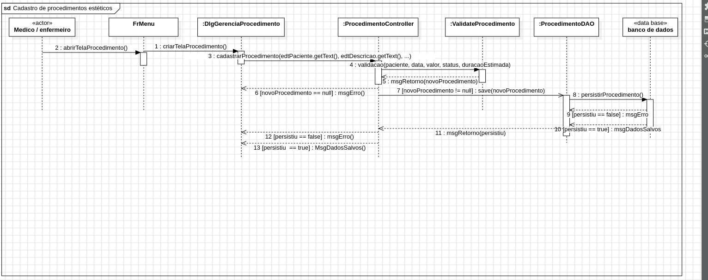

# Estetify

## Índice
1. [Introdução](#introdução)
2. [Modelagem](#modelagem)
    - [Quadro Scrum](#quadro-scrum)
    - [Diagrama de Casos de Uso](#diagrama-de-casos-de-uso)
    - [Diagrama de Classes](#diagrama-de-classes)
    - [Diagrama Entidade-Relacionamento](#diagrama-entidade-relacionamento)
    - [Diagramas de Sequência](#diagramas-de-sequência)
3. [Tecnologias Utilizadas](#tecnologias-utilizadas)
5. [Admin Padrão](#primeiro-login)

---

## Introdução

O **Estetify** é uma plataforma desenvolvida para o gerenciamento completo de clínicas de estética. Nosso objetivo é otimizar a organização e a eficiência das operações clínicas, proporcionando uma experiência aprimorada para administradores, profissionais e clientes.

Com o Estetify, é possível realizar o cadastro e gerenciamento de clientes, agendamentos, procedimentos e relatórios. Além disso, a plataforma oferece segurança no armazenamento de dados, com acesso protegido por login e senha, e diferentes níveis de permissão para usuários. Também é possível gerar relatórios detalhados, facilitando a análise e o acompanhamento das atividades da clínica.

---

## Modelagem

### Quadro Scrum

O desenvolvimento do Estetify segue a metodologia ágil **Scrum**, permitindo um gerenciamento eficiente do projeto através de sprints e priorização de tarefas. O quadro de tarefas está disponível no Trello, onde é possível visualizar o backlog, as sprints em andamento e as tarefas concluídas.

Acesse o quadro Scrum [aqui](https://trello.com/invite/b/671fe8958ac0b1bdcec3f8c2/ATTIe0bde08e1966c5ac09cdfa85c1502dd517AFBA4D/sistema-de-gerenciamento-de-clinica-de-estetica).

---

### Diagrama de Casos de Uso

O Diagrama de Casos de Uso do Estetify apresenta as principais interações entre os usuários e o sistema, ilustrando cenários como:
- Cadastro de clientes
- Agendamento de procedimentos
- Gerenciamento de profissionais e agenda
- Geração de relatórios

---

### Diagrama de Classes

Este diagrama descreve a estrutura de classes que compõem o sistema, destacando as relações entre clientes, profissionais, agendamentos e relatórios. É um modelo detalhado que auxilia na compreensão da lógica do sistema e sua implementação.

---

### Diagrama Entidade-Relacionamento

O Diagrama Entidade-Relacionamento (DER) demonstra a organização dos dados no banco de dados, incluindo entidades como:
- Clientes
- Profissionais
- Procedimentos
- Agendamentos

Este diagrama é essencial para entender como os dados são estruturados no sistema.

---

### Diagramas de Sequência

#### 1. Gerenciar Procedimentos
Este diagrama mostra o fluxo para gerenciar procedimentos.

#### 2. Geração de Relatórios
Ilustra o processo de geração de relatórios de desempenho da clínica e histórico de procedimentos.

---

#### 2. Geração de Feedbacks
Ilustra o processo de geração de relatórios de desempenho da clínica e histórico de procedimentos.

---

## Tecnologias Utilizadas

### Desenvolvimento
- **Java**: Linguagem principal para o backend
- **SQLite**: Banco de dados leve e eficiente
- **Hibernate**: Framework ORM para mapeamento objeto-relacional
- **JavaMail**: Envio de notificações e e-mails automatizados
- **iTextPDF**: Geração de relatórios e documentos em PDF
- **BCrypt**: Criptografia de senhas para segurança

### Interface Gráfica
- **Swing**: Desenvolvimento da interface desktop

### Ferramentas de Apoio
- **Apache NetBeans**: Desenvolvimento do projeto
- **Maven**: Gerenciamento de dependências
- **Git/GitHub**: Controle de versão e colaboração
- **StarUML**: Criação de diagramas UML
- **Trello**: Gerenciamento do projeto

---

   
## Admin Padrão

1. Para realizar o primeiro login no sistema, utilize as seguintes credenciais
- Email: plataformaestetify@gmail.com
- Senha: 123456
